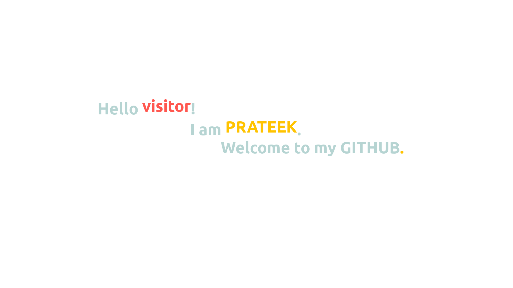

<!--
### Hello visitor! 👋
### I am **Prateek Nanhorya**
-->

**Something about me...**  
😍 ...I love ROBOTICS  
㊙️ ...I like to code in C++  
🌟 ...I have worked with ROS and ROS2  
🎶 ...Setting up micro-controllers is FUN  
💚 ...Love LINUX  
  
  
UnderGrad student @ 
### 🏫 BITS Pilani, K.K. Birla, GOA Campus

Huge fan of AUTOMATION. Always eager to learn and build new **softwares** and **hardwares** trustful enough to be relied upon.
Quick Learner 🦾. Bringing forth a positive attitude to team up and collaborate in projects in Automation domain.

Connect with me here!

<!--
**xD-prateek/xD-prateek** is a ✨ _special_ ✨ repository because its `README.md` (this file) appears on your GitHub profile.

Here are some ideas to get you started:

- 🔭 I’m currently working on ...
- 🌱 I’m currently learning ...
- 👯 I’m looking to collaborate on ...
- 🤔 I’m looking for help with ...
- 💬 Ask me about ...
- 📫 How to reach me: ...
- 😄 Pronouns: ...
- ⚡ Fun fact: ...
-->
